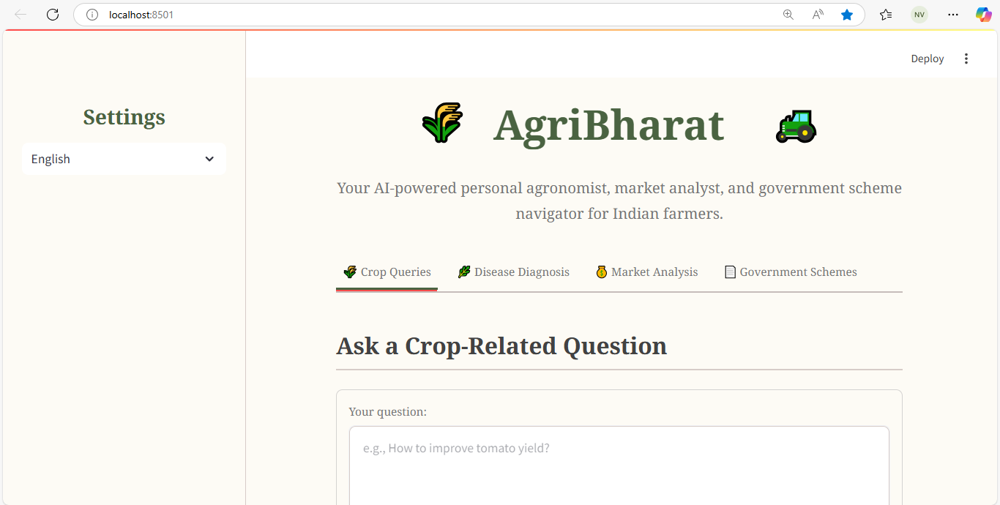

# AgriBharat 🇮🇳

**AgriBharat** is an AI-powered, multilingual web application designed as a comprehensive digital assistant for Indian farmers. It leverages a **multi-agent framework** using the **Google Agent Development Kit (ADK)** and Gemini models to deliver expert agricultural assistance.

It provides advice on crop management, instant plant disease diagnosis, real-time market analysis, and access to government scheme information. Built with Streamlit, it supports multiple Indian languages to ensure broad accessibility for farmers across the nation.

> 📸 _A screenshot of the running application!_  


---

## ✨ Features

- 🌾 **Crop Queries**: Ask any question about crop cultivation, pest control, soil health, or modern farming techniques and get practical, actionable advice.
- 🌿 **AI Disease Diagnosis**: Upload a photo of a plant leaf to instantly identify potential diseases, receive detailed analysis, and get recommendations for affordable, locally-available treatments.
- 💰 **Market Analysis**: Get up-to-date market trends for any crop, including price fluctuations, demand, and supply information, with a focus on data from Indian mandis (e.g., Agmarknet, e-NAM).
- 📄 **Government Schemes**: Easily find and understand relevant Indian government agricultural schemes. Get summaries, eligibility criteria, and links to official application portals.
- 🌐 **Multilingual Support**: The entire interface and all AI-generated responses are available in English, Hindi, Telugu, Kannada, Malayalam, and Tamil.
- 📜 **Consultation History**: All your queries and analyses are saved in a session history, which you can review and download as a single text file for your records.

---

## 🛠️ Tech Stack

- **Frontend**: Streamlit  
- **Backend & AI**: Python, **Google Agent Development Kit (ADK)**  
- **Architecture**: Multi-agent framework using ADK agents  
- **LLM**: Google Gemini Pro  
- **Core Libraries**: `google-genai`, `asyncio`, `google-adk`

---

## 📋 Prerequisites

Before you begin, ensure you have the following installed:

- Python 3.9 or higher  
- Git  
- A Google AI Studio API Key (get it from [Google AI Studio](https://makersuite.google.com/))

---

## 🚀 Installation & Setup

### 1. Clone the Repository

```bash
git clone https://github.com/your-username/agribharat.git
cd agribharat
```

### 2. Create and Activate a Virtual Environment

#### On macOS/Linux:

```bash
python3 -m venv venv
source venv/bin/activate
```

#### On Windows:

```bash
python -m venv venv
.\venv\Scripts\activate
```

### 3. Install Dependencies

```bash
pip install -r requirements.txt
```

### 4. Set Up Environment Variables

Create a file named `.env` in the root of the project directory. Add your Google AI Studio API key:

```env
GOOGLE_API_KEY="YOUR_GOOGLE_API_KEY_HERE"
```

> Note: The `.env` file is included in `.gitignore` to protect your secret key.

### 5. Run the Application

```bash
streamlit run app.py
```

The app will be accessible in your browser at [http://localhost:8501](http://localhost:8501).

---

## 📂 Project Structure

```
agribharat/
├── app.py                # Main Streamlit application UI and logic
├── core.py               # Core multi-agent logic using Google ADK
├── translations.py       # All multilingual UI text and translations
├── requirements.txt      # Python package dependencies
├── .env                  # Environment variables (not tracked by Git)
└── README.md             # This file
```

---

## 💡 Usage

- **Select Language**: Use the sidebar to choose your preferred language.
- **Navigate Tabs**:
  - **Crop Queries**: Type a question about farming and click "Submit".
  - **Disease Diagnosis**: Upload an image of a plant leaf, add an optional question, and click "Diagnose".
  - **Market Analysis**: Enter a crop name and click "Get Market Trends".
  - **Government Schemes**: Ask about a specific scheme or need (e.g., "solar pump subsidy") and click "Get Scheme Details".
- **View History**: Scroll to the bottom to view recent interactions.
- **Download History**: Click the "Download History" button to save all your interactions as a `.txt` file.

---

## 🔍 Example Queries

- **Crop Query**: _"How to improve soil fertility for growing cotton in black soil?"_
- **Disease Diagnosis**: _(Upload a leaf image)_ _"What is this disease on my chili plant and how to treat it organically?"_
- **Market Analysis**: _"Market trends for onions in Maharashtra"_
- **Government Schemes**: _"PM Kisan Samman Nidhi scheme"_

---

## 📄 License

Distributed under the MIT License. See `LICENSE` for more information.
